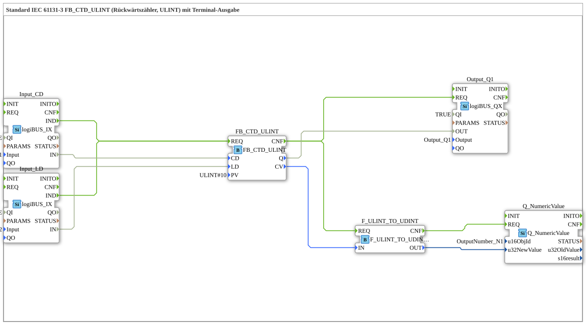

# Exercise_219: Standard IEC 61131-3 FB_CTD_ULINT (Down Counter, ULINT) with Terminal Output

* * * * * * * * * *
## Introduction
This exercise implements a down counter (counter) according to IEC 61131-3 using the function block `FB_CTD_ULINT` (data type ULINT). The counter is controlled via two digital inputs: **CD** (Count Down) decrements the counter value, and **LD** (Load) loads the preset value (PV). The current counter value is output to a terminal (NumericValue). Additionally, a digital output is set when the counter value reaches zero.
## Function Blocks (FBs) Used

### FB_CTD_ULINT (IEC 61131-3 Down Counter)
- **Type**: iec61131::counters::FB_CTD_ULINT
- **Parameters**:
- `PV` = ULINT#10 (Default starting value)
- **Event inputs/outputs**:
- `REQ` (Event input) – triggers counter operation
- `CNF` (Event output) – acknowledgement after execution
- **Data inputs/outputs**:
- `CD` (BOOL) – down count pulse
- `LD` (BOOL) – load PV
- `Q` (BOOL) – Output becomes TRUE when counter value = 0
- `CV` (ULINT) – Current counter value

### Input_CD (Digital Input)
- **Type**: logiBUS::io::DI::logiBUS_IX
- **Parameters**:
- `QI` = TRUE (Qualifier)
- `Input` = Input_I1 (Hardware Input)
- **Event Output**: `IND` – Triggered on signal change
- **Data Output**: `IN` (BOOL) – Current input value

### Input_LD (Digital Input)
- **Type**: logiBUS::io::DI::logiBUS_IX
- **Parameters**:
- `QI` = TRUE
- `Input` = Input_I2
- **Event Output**: `IND`
- **Data Output**: `IN` (BOOL)

### Output_Q1 (Digital Output)
- **Type**: logiBUS::io::DQ::logiBUS_QX
- **Parameters**:
- `QI` = TRUE
- `Output` = Output_Q1
- **Event Input**: `REQ` – adopts new output value
- **Data Input**: `OUT` (BOOL) – Output value to be set

### F_ULINT_TO_UDINT (Type Conversion)
- **Type**: iec61131::conversion::F_ULINT_TO_UDINT
- **Event Input**: `REQ`
- **Event Output**: `CNF`
- **Data Input**: `IN` (ULINT)
- **Data Output**: `OUT` (UDINT)

### Q_NumericValue (Terminal Output)
- **Type**: isobus::UT::Q::Q_NumericValue
- **Parameters**:
- `u16ObjId` = OutputNumber_N1 (Output field identifier)
- **Event input**: `REQ`
- **Data input**: `u32NewValue` (UDINT)

## Program flow and connections

The flow is controlled via event connections:

1. **Processing input signals**:

- If a change occurs at **Input_I1** (CD) or **Input_I2** (LD), the corresponding input block (`Input_CD.IND` or `Input_LD.IND`) triggers an event.
- Both events are connected to the **REQ** input of the counter `FB_CTD_ULINT`. This triggers a counting operation at each of the two inputs.

2. **Counter Operation**:

- The counter `FB_CTD_ULINT` executes the following depending on the state of the data lines:
- If `LD` = TRUE, the value from `PV` (ULINT#10) is loaded.
- If `CD` = TRUE (and `LD` = FALSE), the counter value is decremented by 1.
- After execution, the **CNF** event output is activated.
... 3. **Output and Terminal Output**:

- The `CNF` event is forwarded to two function blocks:
- **Output_Q1**: The counter's data output `Q` (TRUE when the counter value is 0) is set to the hardware output `Output_Q1`.
- **F_ULINT_TO_UDINT**: The current counter value `CV` (ULINT) is converted to the UDINT data type, as the terminal output expects a UDINT.
- After the conversion, `F_ULINT_TO_UDINT.CNF` triggers the **Q_NumericValue** output, so the counter value appears on the terminal (object `OutputNumber_N1`).

**Notes from the comments**:

- It is recommended to insert an **Edge Detection Flip-Flop** between the inputs and the counter to reduce the number of event calls (e.g., during rapid signal changes).
- An **overflow** can occur during the conversion of `F_ULINT_TO_UDINT` because ULINT (64 bits) is converted to UDINT (32 bits). ULINT has a larger value range; only the lower 32 bits are retained. This should be considered when choosing the counter values.

## Summary

Exercise **Exercise_219** demonstrates an IEC 61131-3 compliant down counter with terminal output. It combines digital input, a down counting function, output to a digital output, and numerical display on a screen. Type conversion, event chaining, and hardware interfaces are practiced in this exercise. The provided implementation is a subapp that can be used as a reusable building block in the 4diac IDE.

---

### 🌐 Related topic subpages on ms-muc-docs.de
* [🌐 Eclipse 4diac IDE & Color Reference on ms-muc-docs.de](https://www.ms-muc-docs.de/iec-61499/eclipse-4diac/)

]
