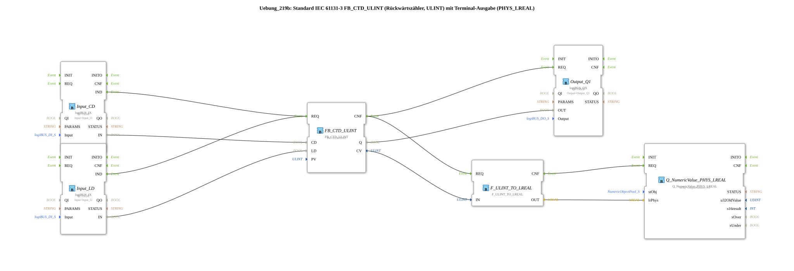

# Exercise_219b: Standard IEC 61131-3 FB_CTD_ULINT (Down Counter, ULINT) with Terminal Output (PHYS_LREAL)

* * * * * * * * * *
## Introduction

This exercise demonstrates a down counter (FB_CTD_ULINT) standardized according to IEC 61131-3 with a counting range of ULINT (0 … 18,446,744,073,709,551,615). The counter is controlled via two digital inputs: **CD** (Count Down) decrements the current count value on each rising edge, and **LD** (Load) resets the count value to the preset value (PV = 10). The current counter value is converted into a physical floating-point number (PHYS_LREAL) via type conversion and output to a terminal. Simultaneously, a digital output is set when the counter value reaches 0.
## Function Blocks (FBs) Used

| Block Name | Type | Parameters / Settings |
|---|---|---|
| **FB_CTD_ULINT** | `iec61131::counters::FB_CTD_ULINT` | `PV = ULINT#10` |
| **Input_CD** | `logiBUS::io::DI::logiBUS_IX` | `QI = TRUE`, `Input = Input_I1` |
| **Input_LD** | `logiBUS::io::DI::logiBUS_IX` | `QI = TRUE`, `Input = Input_I2` |
| **Output_Q1** | `logiBUS::io::DQ::logiBUS_QX` | `QI = TRUE`, `Output = Output_Q1` |
| **F_ULINT_TO_LREAL** | `iec61131::conversion::F_ULINT_TO_LREAL` | – (no parameters) |
| **Q_NumericValue_PHYS_LREAL** | `isobus::UT::Q::Q_NumericValue_PHYS_LREAL` | `stObj = OutputNumber_N3` |

**Functionality of the individual function blocks:**

| Function Block | Description |
|---|---|
| **FB_CTD_ULINT** | Down counter (CTD) for unsigned long integers (ULINT). At the **REQ** event, depending on the currently active input (CD or LD), either the counter value is decremented or the preset value is loaded. The current counter value is available at the **CV** output, and the zero value is available at the **Q** output. |
| **Input_CD** | Digital input block that reads the physical signal `Input_I1` (pushbutton/switch) and triggers the **IND** event on a rising edge. |
| **Input_LD** | Digital input block that reads the physical signal `Input_I2` and triggers the **IND** event on a rising edge. |
| **Output_Q1** | Digital output block that, at the **REQ** event, transfers the value at the **OUT** data input to the physical output `Output_Q1`. |
| **F_ULINT_TO_LREAL** | Conversion block that converts a ULINT value to the LREAL type (64-bit floating-point number). |
| **Q_NumericValue_PHYS_LREAL** | Terminal output block for physical floating-point numbers. It outputs the passed value to the configured object `OutputNumber_N3`. |

## Program Flow and Connections

The flow is controlled by event and data connections:

1. **Capture Input Signals**
- `Input_CD.IND` (rising edge at `Input_I1`) is connected to `FB_CTD_ULINT.REQ`.
- `Input_LD.IND` (rising edge at `Input_I2`) is also connected to `FB_CTD_ULINT.REQ`.

→ The counter is activated on **every** rising edge at one of the two inputs. The distinction between decrementing and loading is made via the data connections.

2. **Assigning Data Values**
- `Input_CD.IN` → `FB_CTD_ULINT.CD` (Count Down)
- `Input_LD.IN` → `FB_CTD_ULINT.LD` (Load)

→ The logical states of the two inputs determine the action:

- If **CD = TRUE** and **LD = FALSE**, the counter value is decremented.
- If **LD = TRUE** (regardless of CD), the preset value (10) is loaded.
3. **Output after processing**

After the counter operation is complete, the **CNF** event of the counter is triggered. This is connected to two subsequent function blocks:

- `Output_Q1.REQ`: The current state of `FB_CTD_ULINT.Q` (counter reading = 0 → TRUE) is written to the digital output `Output_Q1`.
- `F_ULINT_TO_LREAL.REQ`: The current counter value (`FB_CTD_ULINT.CV`) is converted into an LREAL number.
4. **Terminal output**

After the conversion, `F_ULINT_TO_LREAL.CNF` triggers the function block `Q_NumericValue_PHYS_LREAL.REQ`. The converted value (`F_ULINT_TO_LREAL.OUT`) is displayed as a physical floating-point number at the terminal under `OutputNumber_N3`.

The entire logic operates **event-driven**: Any change to one of the inputs triggers a complete processing chain – from reading the input through the counter logic to outputting the current counter value and the digital signal.

## Summary

Exercise **Exercise_219b** implements an IEC 61131-3 compliant reverse counter (FB_CTD_ULINT) in the 4diac IDE. It demonstrates:

- the parameterization of a standardized counter block (Preset = 10),
- the connection of digital inputs/outputs via logiBUS blocks,
- the type conversion from ULINT to LREAL,
- the output of measured values to a terminal (PHYS_LREAL).

The focus is on understanding event and data flows, as well as the structured interconnection of function blocks in an automation application.

---

### 🌐 Related topic subpages on ms-muc-docs.de

- [🌐 Eclipse 4diac IDE & color reference on ms-muc-docs.de](https://www.ms-muc-docs.de/iec-61499/eclipse-4diac/)

]
