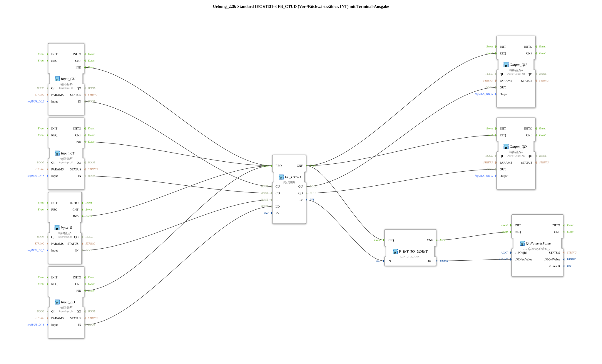

# Exercise_220: Standard IEC 61131-3 FB_CTUD (Up/Down Counter, INT) with Terminal Output

* * * * * * * * * *
## Introduction

This exercise implements a combined up/down counter according to IEC 61131-3 (FB CTUD) with a preset threshold of 10. The counter values are output via digital outputs as well as a numerical value on a terminal. The inputs are provided via logiBUS input blocks.
## Function Blocks (FBs) Used

- **FB_CTUD** (Type: `iec61131::counters::FB_CTUD`): Standard IEC 61131-3 Up/Down Counter.
- Parameters: `PV` = `INT#10` (Preset value)
- Event inputs: `REQ` (Request)
- Event outputs: `CNF` (Acknowledgement)
- Data inputs: `CU` (Count Up), `CD` (Count Down), `R` (Reset), `LD` (Load)
- Data outputs: `QU` (Output when preset is reached), `QD` (Output when 0 is reached), `CV` (Current Counter value)
- **Input blocks** (Type: `logiBUS_IX`):
- `Input_CU` (Input for up count pulses) – connected to `Input_I1`
- `Input_CD` (Input for down count pulses) – connected to `Input_I2`
- `Input_R` (Reset input) – connected to `Input_I3`
- `Input_LD` (Load input) – connected to `Input_I4`
- All have the parameter `QI` = `TRUE`.
- **Output Blocks** (Type: `logiBUS_QX`):
- `Output_QU` (Output QU) – connected to `Output_Q1`
- `Output_QD` (Output QD) – connected to `Output_Q2`
- All have the parameter `QI` = `TRUE`.
- **F_INT_TO_UDINT** (Type: `iec61131::conversion::F_INT_TO_UDINT`): Converts the integer counter value (CV) to an unsigned double integer (UDINT) for terminal output.
- **Q_NumericValue** (Type: `isobus::UT::Q::Q_NumericValue`): Outputs a numeric value to the terminal.
- Parameter: `u16ObjId` = `OutputNumber_N1`

Note: According to the comment, using `F_INT_TO_UDINT` is "nonsense... negative numbers are not possible" because the counter value can also be negative (if there are more backward than forward pulses). However, this exercise demonstrates the use of the FB CTUD.

## Program Flow and Connections

This exercise demonstrates the typical application of an IEC 61131-3 counter with hardware inputs and outputs via the logiBUS.

- **Event Control**: Each input block (`Input_CU`, `Input_CD`, `Input_R`, `Input_LD`) triggers a `REQ` on a rising edge (`IND`) and sends it to `FB_CTUD`. This updates the counter with each pulse. After processing, `FB_CTUD` outputs a `CNF`, which simultaneously triggers the output blocks (`Output_QU`, `Output_QD`) as well as the conversion and terminal output.

`FB_CTUD`` outputs a `CNF`, which simultaneously triggers the output blocks (`Output_QU`, `Output_QD`) as well as the conversion and terminal output.

- **Data Connections**:

- The digital input signals (`IN` and `logiBUS_IX`) are directly connected to the corresponding data inputs of the meter (`CU`, `CD`, `R`, `LD`).
- The meter outputs `QU` and `QD` are connected to the logiBUS outputs (`OUT` and `logiBUS_QX`).
- The current counter value `CV` is converted to `UDINT` via `F_INT_TO_UDINT` and passed to `Q_NumericValue`, which displays it on the terminal (output number `N1`).
- **Learning Objectives**:
- Understanding the IEC 61131-3 FB_CTUD (forward/downward counter) with all its functions.
- Integration of hardware inputs/outputs via logiBUS.
- Outputting a numeric value to a terminal.
- Recognizing limitations in data type conversion (negative values).
- **Difficulty Level**: Medium. Prior knowledge of IEC 61131-3 and the 4diac IDE is helpful.

## Summary

In this exercise, a forward/downward counter according to IEC 61131-3 was implemented. The counter increments on each rising edge at the inputs `CU` (up) and `CD` (down). A reset (`R`) resets the counter to `0`, and a load (`LD`) loads the preset value `PV`. The outputs `QU` and `QD` indicate whether the counter reading has reached the preset value (`QU`) and `0` (`QD`), respectively. Additionally, the current counter value is displayed on a terminal, with conversion to `UDINT` for positive values. This exercise demonstrates the complete integration of standard function blocks (FBs) with logiBUS hardware and terminal output in the 4diac IDE.

---

### 🌐 Related topic subpages on ms-muc-docs.de

- [🌐 Eclipse 4diac IDE & color reference on ms-muc-docs.de ](https://www.ms-muc-docs.de/iec-61499/eclipse-4diac/)

]
