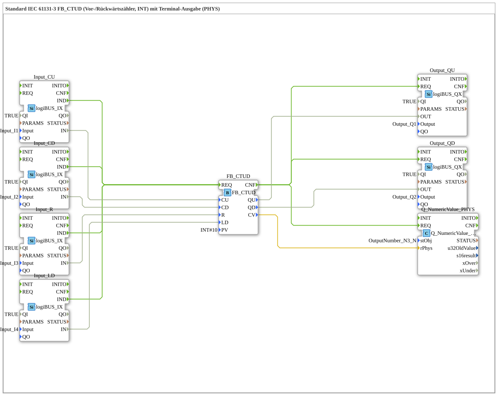

# Exercise_220b: Standard IEC 61131-3 FB_CTUD (Up/Down Counter, INT) with Terminal Output (PHYS)

* * * * * * * * * *
## Introduction
This exercise describes the implementation of an up/down counter (type CTUD) according to IEC 61131-3. The counter has an up count input (CU), a down count input (CD), a reset input (R), and a load input (LD). The current count value (CV) is output to a physical terminal (PHYS). Additionally, the two end-of-count values, QU (overflow when the maximum value is reached) and QD (underflow when the minimum value is reached), are output to digital outputs. Control is achieved via four digital inputs (I1 … I4).

```
## Function Blocks (FBs) Used

This exercise does not use any additional sub-blocks, but instead uses the following predefined function blocks directly from the network:

- **FB_CTUD** (Type: `iec61131::counters::FB_CTUD`)

*Parameter*: `PV = INT#10` (count threshold, corresponding to a preset value of 10).

This block functions as a forward/downward counter with event control and outputs `QU`, `QD`, and `CV`.

- **Input_CU**, **Input_CD**, **Input_R**, **Input_LD** (Type: `logiBUS::io::DI::logiBUS_IX`)

*Parameters*: `QI = TRUE`, `Input = Input_I1` … `Input_I4`.

Four digital inputs that map the physical inputs I1 to I4 to the internal data values.

- **Output_QU**, **Output_QD** (Type: `logiBUS::io::DQ::logiBUS_QX`)

*Parameters*: `QI = TRUE`, `Output = Output_Q1`, and `Output_Q2`, respectively.

Two digital outputs that transmit the counter's overflow and underflow conditions to the physical outputs Q1 and Q2.

- **Q_NumericValue_PHYS** (Type: `isobus::UT::Q::Q_NumericValue_PHYS`)

*Parameter*: `stObj = OutputNumber_N3` (default from the pool `DefaultPool_Numeric`).

This function block outputs the current counter value as a real value to a terminal. It receives the numerical value via the data input `rPhys`.

## Program Flow and Connections

The flow is controlled via event and data connections.

**Event Connections**

- The `IND` events of all four digital inputs (Input_CU, Input_CD, Input_R, Input_LD) are connected to the `REQ` input of the counter FB_CTUD. Each rising edge at any of the inputs triggers a recalculation of the counter.
- After successful recalculation, the counter sends the `CNF` event. This is distributed to the `REQ` inputs of the three output blocks (Output_QU, Output_QD, Q_NumericValue_PHYS), so that the output values are updated in parallel.

`` **Data Connections**

- The digital input values (`IN`) from Input_CU, Input_CD, Input_R, and Input_LD are routed to the corresponding data inputs of the counter (`CU`, `CD`, `R`, `LD`).
- The binary output signals `QU` and `QD` from the counter are transferred to the data inputs `OUT` of the output blocks Output_QU and Output_QD.

`` - The current counter value `CV` (data type `INT`) is assigned to input `rPhys` of the terminal output block. A network comment explains that `INT` can be interpreted as `REAL` without explicit conversion (implicit type conversion is permitted).

**Special Features**

- The counter operates according to the CTUD specification: A positive pulse at `CU` increments the counter value, while a pulse at `CD` decrements it. A signal at `R` resets the counter value to zero, and a signal at `LD` loads the preset value stored in `PV`.
- This exercise provides an understanding of a combined forward/down counter with hardware connectivity and visual terminal output. Prior knowledge of IEC 61131-3 counters and basic event/data connections is helpful.

## Summary

Exercise "Exercise_220b" implements a complete IEC 61131-3 compliant forward/down counter (CTUD) with digital inputs and outputs, as well as a physical terminal output of the current counter value. Control is via four pushbuttons, and the counter readings are output as overflow and underflow to two outputs. The process demonstrates the typical wiring of an event-driven counter with distributed I/O modules and a numeric display module.
