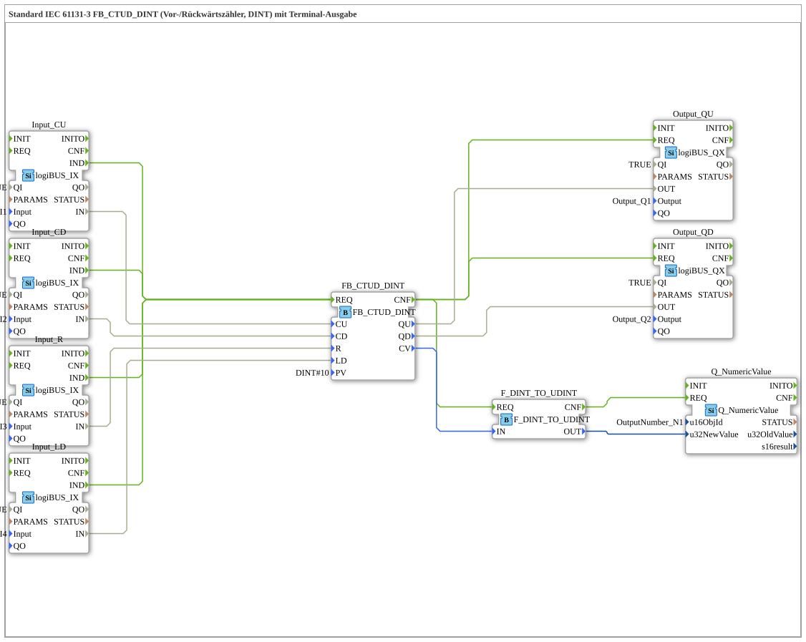

# Exercise_221: Standard IEC 61131-3 FB_CTUD_DINT (Up/Down Counter, DINT) with Terminal Output

* * * * * * * * * *
## Introduction

This exercise implements a combined up/down counter based on the IEC 61131-3 standard function block `FB_CTUD_DINT`. The counted value is stored as an integer (DINT) and, after conversion, displayed on a numeric display (terminal). Additionally, two binary outputs are set to indicate whether the counter has reached the upper (QU) or lower (QD) limit.
Control is achieved via four digital inputs (CU, CD, Reset, Load Initial Value) connected via the logiBUS.

## Function Blocks (FBs) Used

### Core Function Block

- **FB_CTUD_DINT** (Type: `iec61131::counters::FB_CTUD_DINT`)
- Parameterization: `PV` = `DINT#10` (Comparison value for QU/QD)
- Function: IEC 61131-3 compliant forward/down counter with DINT values. Counts on every rising edge at CU (Count Up) or CD (Count Down). Sets QU to TRUE when `CV >= PV`, and QD to TRUE when `CV <= 0`. The counter is reset to 0 via `R`. The current value of `PV` is loaded via `LD`.

### Digital Inputs (logiBUS)

- **Input_CU**, **Input_CD**, **Input_R**, **Input_LD** (Type: `logiBUS::io::DI::logiBUS_IX`)
- Parameterization: `QI` = `TRUE`
- Function: Reads the physical inputs `Input_I1` to `Input_I4` and provides the binary value at the data output `IN`. An event `IND` is triggered on each change.

### Digital Outputs (logiBUS)

- **Output_QU**, **Output_QD** (Type: `logiBUS::io::DQ::logiBUS_QX`)
- Parameterization: `QI` = `TRUE`
- Function: Sets the physical outputs `Output_Q1` and `Output_Q2` according to the value at the data input `OUT`.

### Output of the counter value to a terminal

- **Q_NumericValue** (Type: `isobus::UT::Q::Q_NumericValue`)
- Parameterization: `u16ObjId` = `OutputNumber_N1`
- Function: Displays a numeric value (UDINT) on a terminal (e.g., HMI). The data value is passed via `u32NewValue`.
- **F_DINT_TO_UDINT** (Type: `iec61131::conversion::F_DINT_TO_UDINT`)
- Function: Converts a DINT value to a UDINT value. This displays the counter value (which could be negative) as an unsigned integer. (Note: This conversion is not useful for negative counter values, as negative DINT values are converted to UDINT.)

## Program Flow and Connections

1. **Event Linking**: Each of the four digital inputs (Input_CU, Input_CD, Input_R, Input_LD) triggers the execution of the counter `FB_CTUD_DINT` (input event `REQ`) upon a change in state (event `IND`).

→ All inputs are directly connected to the same `REQ` event of the counter. This means that the counter is reprocessed whenever any input changes.

2. **Data Linking**:
- The input values `IN` of the digital inputs are routed to the corresponding data inputs of the counter: `CU`, `CD`, `R`, `LD`.
- After the counter processing (`CNF` event):
- The outputs `QU` and `QD` are forwarded to the output blocks `Output_QU` and `Output_QD`. These set the physical outputs.

- The current counter value `CV` is converted to an unsigned value via `F_DINT_TO_UDINT` and passed to `Q_NumericValue`, which displays the value on the terminal.

3. **Process**:
- A rising edge at CU increments the counter by 1.
- A rising edge at CD decrements the counter by 1.
- A rising edge at R resets the counter to 0.
- A rising edge at LD loads the value from `PV` (here 10) into the counter.
- As soon as the counter value reaches or exceeds the reference value `PV`, `QU` is set to TRUE. When the value falls below 0, `QD` is set to TRUE.

**Learning Objectives**:

- Understanding and application of the IEC 61131-3 standard counter `CTUD`.
- Integration of logiBUS I/O modules into a 4diac application.
- Output of numerical values to a terminal.
- Working with event and data connections in 4diac.

**Difficulty Level**: Easy

**Prerequisites**: Basic knowledge of the 4diac IDE, IEC 61131-3 function blocks, logiBUS configuration.

## Summary

Exercise **Exercise_221** implements a fully functional forward/down counter according to IEC 61131-3 with four digital inputs, two digital outputs, and a numerical terminal display. This setup demonstrates the clean separation of event and data flows, as well as the integration of standard libraries (IEC 61131-3, logiBUS, isobus) in a 4diac sub-application. The conversion from DINT to UDINT is a deliberate highlight of potential pitfalls when displaying negative numbers.

---

### 🌐 Related topic subpages on ms-muc-docs.de

- [🌐 Eclipse 4diac IDE & Color Reference on ms-muc-docs.de](https://www.ms-muc-docs.de/iec-61499/eclipse-4diac/)

]
