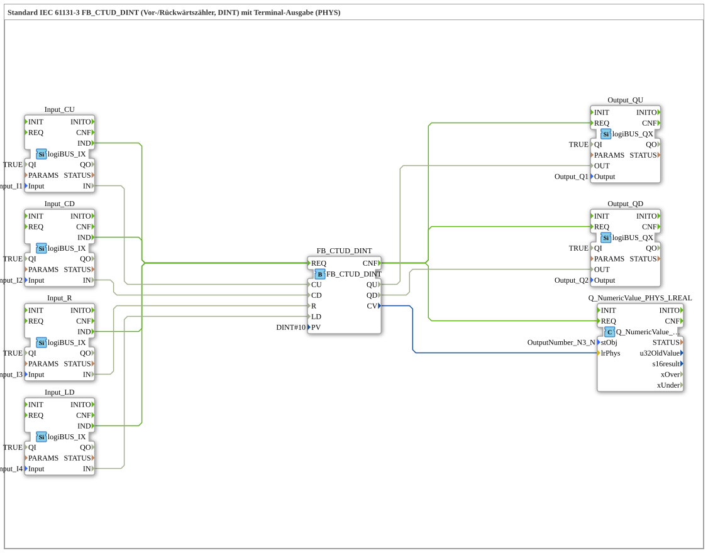

# Exercise_221b: Standard IEC 61131-3 FB_CTUD_DINT (Forward/Backward Counter, DINT) with Terminal Output (PHYS)

* * * * * * * * * *
## Introduction

This exercise implements a combined forward/backward counter according to IEC 61131-3 (type `FB_CTUD_DINT`) and outputs the current counter value as well as the counter status (overflow/underflow) via digital outputs and a terminal output (PHYS). The counter can be controlled via four digital inputs: count up (CU), count down (CD), reset (R), and load the initial value (LD).

## Function Blocks (FBs) Used

- **`FB_CTUD_DINT`** (Type: `iec61131::counters::FB_CTUD_DINT`)

- Parameters: `PV` = `DINT#10` (Start value on load)

- Event inputs: `REQ` (Processing starts)

- Event outputs: `CNF` (Processing complete)

- Data inputs: `CU` (Count Up), `CD` (Count Down), `R` (Reset), `LD` (Load)

- Data outputs: `QU` (Count Up reached), `QD` (Count Down reached), `CV` (Current counter value)

- **Input FBs (logiBUS digital inputs)**

- `Input_CU` (Type `logiBUS::io::DI::logiBUS_IX`): Input signal for `CU`

- `Input_CD` (Type `logiBUS::io::DI::logiBUS_IX`): Input signal for `CD`

- `Input_R` (Type `logiBUS::io::DI::logiBUS_IX`): Input signal for `R`

- `Input_LD` (Type `logiBUS::io::DI::logiBUS_IX`): Input signal for `LD`

- Parameters of all: `QI` = `TRUE` (channel activation), `Input` = assigned logiBUS channel (e.g., `Input_I1` to `Input_I4`)

- **Output FBs (logiBUS digital outputs)**

- `Output_QU` (type `logiBUS::io::DQ::logiBUS_QX`): signals `QU` (meter reading ≥ PV)

- `Output_QD` (type `logiBUS::io::DQ::logiBUS_QX`): signals `QD` (counter reading ≤ 0)

- Parameters of all: `QI` = `TRUE`, `Output` = assigned logiBUS channel (e.g., `Output_Q1`, `Output_Q2`)

- **Terminal Output Function Block**

- `Q_NumericValue_PHYS_LREAL` (type `isobus::UT::Q::Q_NumericValue_PHYS_LREAL`): outputs the current counter reading (as LREAL) on a physical display

- Parameters: `stObj` = `OutputNumber_N3` (reference to the Terminal Output Element

## Program Flow and Connections

The system operates in an event-driven manner:

1. **Input Processing**: Each of the four input function blocks (Input_CU, Input_CD, Input_R, Input_LD) generates an event (`IND`) upon a signal change.

2. **Counter Calculation**: All four events are connected to the `REQ` input of the counter `FB_CTUD_DINT`. This ensures the counter is evaluated with each new input signal.

3. **Output Update**: After the meter calculation (`CNF`) is complete, the output function blocks (FBs) and the terminal FB are triggered simultaneously:

- `Output_QU` receives the value from `QU`

- `Output_QD` receives the value from `QD`

- `Q_NumericValue_PHYS_LREAL` receives the current meter reading from `CV`

**Data Connections**:

- `Input_CU.IN` → `FB_CTUD_DINT.CU`

- `Input_CD.IN` → `FB_CTUD_DINT.CD`
- `Input_R.IN` → `FB_CTUD_DINT.R`
- `Input_LD.IN` → `FB_CTUD_DINT.LD`
- `FB_CTUD_DINT.QU` → `Output_QU.OUT`
- `FB_CTUD_DINT.QD` → `Output_QD.OUT`
- `FB_CTUD_DINT.CV` → `Q_NumericValue_PHYS_LREAL.lrPhys`

**Counter Behavior**:

- On a rising edge at `CU`, the counter is incremented by 1.

- On a rising edge at `CD`, the counter is decremented by 1.

- On a rising edge at `R`, the counter is reset to 0.

- On a rising edge at `LD`, the counter is reset to the value of `PV` (here, 10).

- The output `QU` becomes `TRUE` as soon as the counter reading is ≥ PV; `QD` becomes `TRUE` as soon as the counter reading is ≤ 0.

## Summary

This exercise demonstrates the use of a universal IEC 61131-3 forward/reverse counter (`FB_CTUD_DINT`) in combination with digital inputs and outputs, as well as a physical terminal output. The counter is controlled via four pushbuttons, the status outputs are displayed on LEDs, and the current counter reading appears on a display. This is a basic task introducing counting functions and signal processing in automation technology.