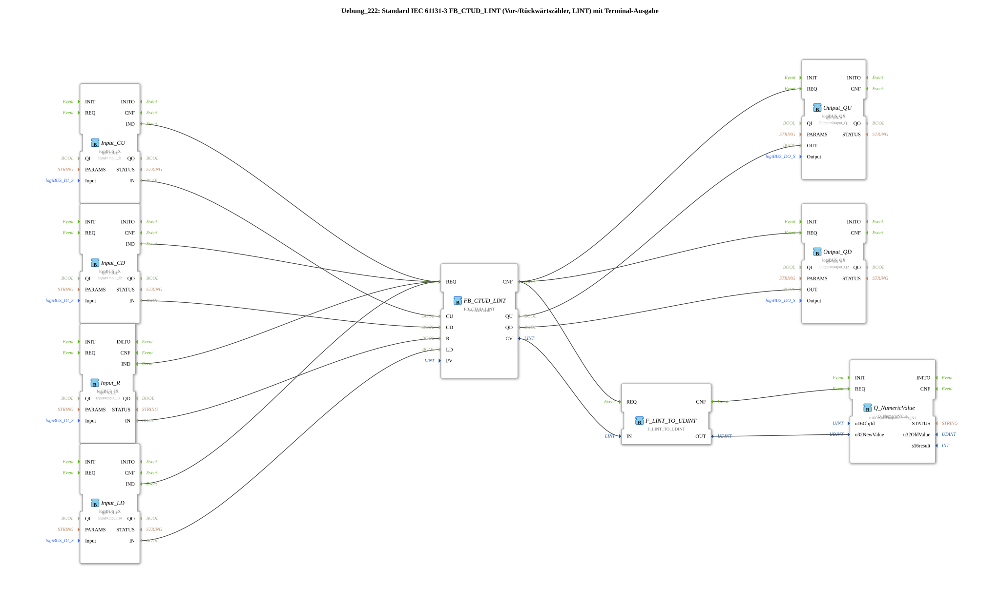

# Exercise_222: Standard IEC 61131-3 FB_CTUD_LINT (Forward/Down Counter, LINT) with Terminal Output

* * * * * * * * * *
## Introduction
This exercise implements a forward/down counter according to IEC 61131-3 (type `FB_CTUD_LINT`) with a value range of type `LINT`. The counter readings are controlled via a logiBUS I/O connection to digital inputs (pushbuttons) and output to digital outputs (signal lights). Additionally, the current counter reading is displayed via a numeric terminal output (`Q_NumericValue`). This exercise demonstrates the use of a complex counter and the conversion of `LINT` to `UDINT` for output, with a comment indicating the limitation of the conversion (negative values cannot be represented).

## Function Blocks (FBs) Used

The exercise contains the following function blocks directly at the top level (no sub-blocks):

- **FB_CTUD_LINT** (Type: `iec61131::counters::FB_CTUD_LINT`)
- Parameters: `PV` = `LINT#10` (Default value 10)
- Event inputs: `REQ` (Request)
- Event outputs: `CNF` (Acknowledge)
- Data inputs: `CU` (Count Up Pulse), `CD` (Count Down Pulse), `R` (Reset to 0), `LD` (Charging PV)
- Data outputs: `QU` (up counter reaches PV), `QD` (down counter reaches 0), `CV` (current counter value)
- **Functionality**: The function block operates as a forward/backward counting timer with a 64-bit counter (`LINT`). The counter is incremented on each rising edge at `CU` and decremented on `CD`. The counter is reset to 0 via `R` and loaded to the value of `PV` via `LD`. `QU` is active when `CV >= PV` is active, and `QD` is active when `CV <= 0` is active.

QU` is active when `CV >= PV` is active. - **Input_CU** (Type: `logiBUS::io::DI::logiBUS_IX`)

- Parameters: `QI` = `TRUE`, `Input` = `Input_I1`
- Output: `IN` (digital value), `IND` (event on edge)
- **Input_CD** (Type: `logiBUS::io::DI::logiBUS_IX`)
- Parameters: `QI` = `TRUE`, `Input` = `Input_I2`
- **Input_R** (Type: `logiBUS::io::DI::logiBUS_IX`)
- Parameters: `QI` = `TRUE`, `Input` = `Input_I3`
- **Input_LD** (Type: `logiBUS::io::DI::logiBUS_IX`)
- Parameters: `QI` = `TRUE`, `Input` = `Input_I4`
- **Output_QU** (Type: `logiBUS::io::DQ::logiBUS_QX`)
- Parameters: `QI` = `TRUE`, `Output` = `Output_Q1`
- Input: `OUT` (Value), `REQ` (Event)
- **Output_QD** (Type: `logiBUS::io::DQ::logiBUS_QX`)
- Parameters: `QI` = `TRUE`, `Output` = `Output_Q2`
- **Q_NumericValue** (Type: `isobus::UT::Q::Q_NumericValue`)
- Parameters: `u16ObjId` = `OutputNumber_N1`
- Input: `REQ` (event), `u32NewValue` (numeric value)
- **How it works**: This function block outputs a 32-bit unsigned value to a numeric display in the terminal. The object ID refers to a predefined output channel.
- **F_LINT_TO_UDINT** (Type: `iec61131::conversion::F_LINT_TO_UDINT`)
- Input: `REQ` (Event), `IN` (Value of type `LINT`)
- Output: `CNF` (Event), `OUT` (Value of type `UDINT`)
- **Functionality**: Converts a 64-bit integer value (LINT) to a 32-bit unsigned value (UDINT). **Note**: Negative input values cannot be displayed correctly because the target range only allows positive numbers. The exercise includes a comment indicating this limitation.

## Program Flow and Connections

Control is achieved via four digital inputs (logiBUS) that function as pushbuttons:

- **Input_I1** (CU): Count up
- **Input_I2** (CD): Count down
- **Input_I3** (R): Reset counter to 0
- **Input_I4** (LD): Load counter to preset value PV (=10)

Each input block generates an event (`IND`) on a rising edge. These events are switched to the event input `REQ` of the counter block `FB_CTUD_LINT`. The counter then responds to the corresponding data input (`CU`, `CD`, `R`, `LD`).

`` The data connections transmit the logical states of the buttons:

- `Input_CU.IN` → `FB_CTUD_LINT.CU`
- `Input_CD.IN` → `FB_CTUD_LINT.CD`
- `Input_R.IN` → `FB_CTUD_LINT.R`
- `Input_LD.IN` → `FB_CTUD_LINT.LD`

After processing the counter, the confirmation event (`CNF`) is forwarded to several outputs:

- `Output_QU.REQ` and `Output_QD.REQ` → updates the digital outputs
- `F_LINT_TO_UDINT.REQ` → starts the Type Conversion

The data outputs `QU` and `QD` control the digital outputs:

- `FB_CTUD_LINT.QU` → `Output_QU.OUT` (output terminal `Output_Q1`)
- `FB_CTUD_LINT.QD` → `Output_QD.OUT` (output terminal `Output_Q2`)

The current meter reading (`CV`) is routed via the conversion `F_LINT_TO_UDINT`:

- `FB_CTUD_LINT.CV` → `F_LINT_TO_UDINT.IN`
- `F_LINT_TO_UDINT.OUT` → `Q_NumericValue.u32NewValue`

After successful conversion, `F_LINT_TO_UDINT.CNF` triggers the event `Q_NumericValue.REQ`, which displays the value on the terminal.

**Learning Objectives**:

- Introduction to IEC 61131-3 counter blocks (CTUD) with large data width
- Use of logiBUS input/output modules
- Type conversion and its pitfalls (no negative numbers with UDINT)
- Event-driven sequence control in 4diac

**Note**: This exercise requires basic knowledge of the 4diac IDE and logiBUS configuration. The inputs must be connected to real or simulated pushbuttons; the outputs to lights or status indicators.

**Learning Objectives**:

- Introduction to IEC 61131-3 counter blocks (CTUD) with large data width
- Use of logiBUS input/output modules
- Type conversion and its pitfalls (no negative numbers with UDINT)
- Event-driven sequence control in 4diac

**Note**: This exercise requires basic knowledge of the 4diac IDE and logiBUS configuration. The inputs must be connected to real or simulated pushbuttons; the outputs to lights or status indicators.

**
## Summary

Exercise 222 implements a universal forward/downward counter (FB_CTUD_LINT) with a 64-bit counting range, controlled by four push-button inputs. Two digital outputs indicate the states `QU` (maximum reached) and `QD` (minimum reached), while a terminal outputs the current numerical value. The necessary type conversion from `LINT` to `UDINT` is deliberately documented as a problem case to highlight the potential misinterpretation of negative values. The design adheres to the IEC 61131-3 standard and allows for easy extension to include other counting parameters.

---

### 🌐 Related topic subpages on ms-muc-docs.de
* [🌐 Eclipse 4diac IDE & Color Reference on ms-muc-docs.de](https://www.ms-muc-docs.de/iec-61499/eclipse-4diac/)
