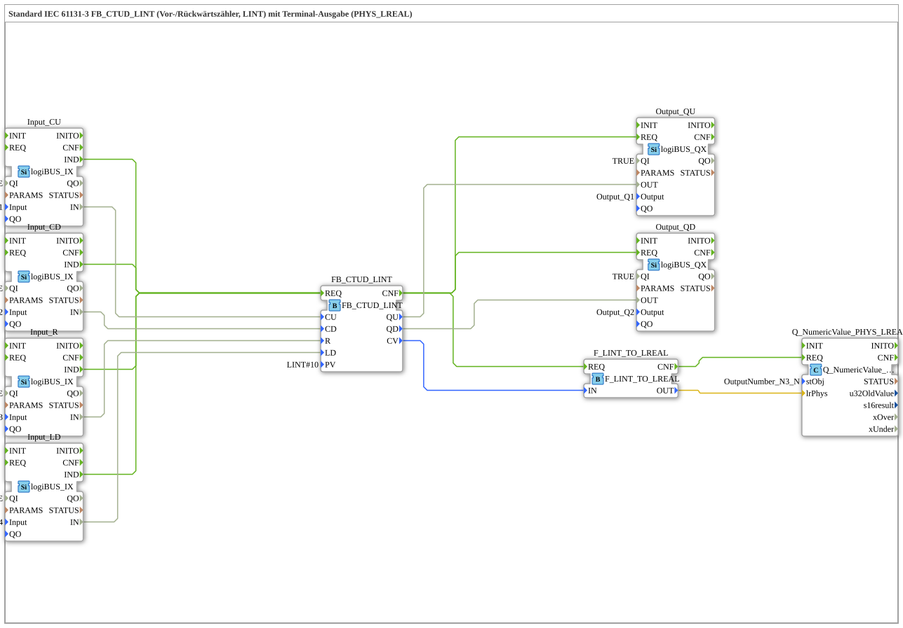

# Exercise_222b: Standard IEC 61131-3 FB_CTUD_LINT (Up/Down Counter, LINT) with Terminal Output (PHYS_LREAL)

* * * * * * * * * *
## Introduction
This exercise implements a standard-compliant IEC 61131-3 up/down counter with the data type **LINT** (64-bit integer). The counter is controlled via four digital inputs: count up (CU), count down (CD), reset (R), and load preset value (LD). The current counter value is output to two digital outputs (QU and QD) and, via a data type converter, as a physical floating-point value (LREAL) on a terminal. This allows the counter value to be monitored directly in the development environment during operation.
## Function Blocks (FBs) Used

| Block Name | Type | Parameters | Description |
|--------------|-----|-----------|--------------|
| `FB_CTUD_LINT` | `iec61131::counters::FB_CTUD_LINT` | PV = `LINT#10` | Up/down counter (LINT). Counts up on CU events, down on CD events. An R event resets the counter to 0, an LD event loads the preset value PV. |
| `Input_CU` | `logiBUS::io::DI::logiBUS_IX` | QI = TRUE, Input = `Input_I1` | Digital input (logiBUS) – signal for counting up. |
| `Input_CD` | `logiBUS::io::DI::logiBUS_IX` | QI = TRUE, Input = `Input_I2` | Digital input – countdown signal. |
| `Input_R` | `logiBUS::io::DI::logiBUS_IX` | QI = TRUE, Input = `Input_I3` | Digital input – reset signal. |
| `Input_LD` | `logiBUS::io::DI::logiBUS_IX` | QI = TRUE, Input = `Input_I4` | Digital input – load signal for preset value. |
| `Output_QU` | `logiBUS::io::DQ::logiBUS_QX` | QI = TRUE, Output = `Output_Q1` | Digital output – becomes active when the meter reading is ≥ PV. |
| `Output_QD` | `logiBUS::io::DQ::logiBUS_QX` | QI = TRUE, Output = `Output_Q2` | Digital output – becomes active when the meter reading is ≤ 0. |
| `F_LINT_TO_LREAL` | `iec61131::conversion::F_LINT_TO_LREAL` | – | Converts the current meter reading (LINT) to the floating-point data type LREAL. |
| `Q_NumericValue_PHYS_LREAL` | `isobus::UT::Q::Q_NumericValue_PHYS_LREAL` | stObj = `OutputNumber_N3` | Outputs the converted value as a physical LREAL value to the terminal (OutputNumber_N3). |

## Program Flow and Connections

1. **Event Chaining**

- Each key press on one of the four inputs (Input_CU, Input_CD, Input_R, Input_LD) triggers the event `IND`.
- These events are all routed to the event input `REQ` of the counter `FB_CTUD_LINT`.
- After processing (event output `CNF`), the subsequent function blocks `Output_QU` and `Output_QD`, as well as the converter `F_LINT_TO_LREAL`, are triggered.
- After the conversion, the terminal object `Q_NumericValue_PHYS_LREAL` is updated.

`` 2. **Data Chaining**

- The digital input signals (IN) are connected directly to the corresponding counter inputs:
* Input_CU.IN → FB_CTUD_LINT.CU
* Input_CD.IN → FB_CTUD_LINT.CD
* Input_R.IN → FB_CTUD_LINT.R
* Input_LD.IN → FB_CTUD_LINT.LD
- The counter outputs:
* FB_CTUD_LINT.QU → Output_QU.OUT (Switches output Q1)
* FB_CTUD_LINT.QD → Output_QD.OUT (Switches output Q2)
- The current counter reading (CV, LINT) is converted to LREAL via the converter:
* FB_CTUD_LINT.CV → F_LINT_TO_LREAL.IN
* F_LINT_TO_LREAL.OUT → Q_NumericValue_PHYS_LREAL.lrPhys
- The terminal thus displays the counter reading as a decimal floating-point number.

3. **Learning Objectives**

- Understanding the IEC 61131-3 CTUD function block (LINT).
- Working with digital inputs/outputs in the logiBUS system.
- Data type conversion from LINT to LREAL.
- Visualizing process values via a terminal object.

4. **Difficulty Level & Prior Knowledge**

- **Difficulty:** Medium.
- **Prior Knowledge:** Basic knowledge of the 4diac IDE, working with SubApp types, event and data connections, basic IEC 61131-3 knowledge.

5. **Execution**

- Load the exercise into the 4diac IDE.
- Assign the corresponding logiBUS channels (Input_I1 … I4, Output_Q1, Q2).
- Start the simulation or transfer it to the target hardware.
- Observe the counter readings on the terminal (OutputNumber_N3) and the outputs Q1 and Q2.

## Summary

Exercise 222b demonstrates a complete IEC 61131-3 compliant forward/down counter with a LINT data type. By combining digital inputs/outputs, a standard counter, and data type conversion, a simple yet practical counter setup is implemented, the current value of which can be observed via a terminal. This example is particularly suitable for learning event logic and data conversion between integer and floating-point types in 4diac.

---

### 🌐 Related topic subpages on ms-muc-docs.de
* [🌐 Eclipse 4diac IDE & Color Reference on ms-muc-docs.de](https://www.ms-muc-docs.de/iec-61499/eclipse-4diac/)

]
