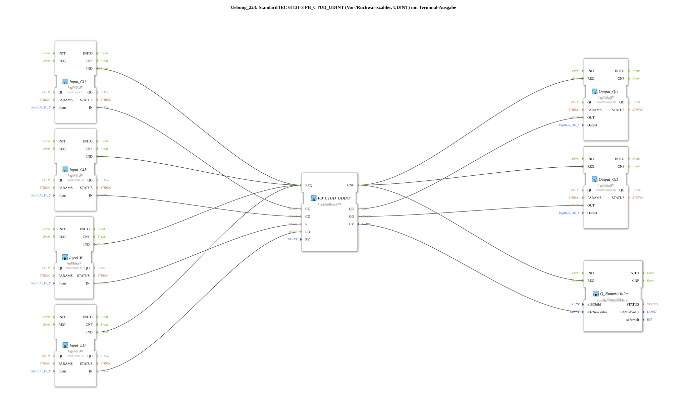

# Exercise_223: Standard IEC 61131-3 FB_CTUD_UDINT (Up/Down Counter, UDINT) with Terminal Output

* * * * * * * * * *
## Introduction

This exercise implements an up/down counter (FB_CTUD_UDINT) according to IEC 61131-3 with data type UDINT. The counter is controlled via digital inputs and outputs the current counter value as well as two output signals (QU, QD) to digital outputs. Additionally, the counter value is displayed on a terminal (Q_NumericValue).
This exercise demonstrates the use of logiBUS input/output blocks in conjunction with a standardized counter FB. A comment in the network suggests that E_D_FF blocks may be needed to reduce the number of events.

## Function Blocks Used (FBs)

The following function blocks are used in the sub-app:

- **FB_CTUD_UDINT** – IEC 61131-3 Forward/Backward Counter (UDINT)
- Parameters: `PV` = `UDINT#10`
- Event input: `REQ`
- Data inputs: `CU` (Count forward), `CD` (Count backward), `R` (Reset), `LD` (Load value from PV)
- Data outputs: `QU` (Counter reading >= PV), `QD` (Counter reading = 0), `CV` (current counter value, UDINT)
- **Input_CU** – Digital input (logiBUS_IX)
- Parameters: `QI` = TRUE, `Input` = `Input_I1`
- **Input_CD** – Digital input (logiBUS_IX)
- Parameters: `QI` = TRUE, `Input` = `Input_I2`
- **Input_R** – Digital input (logiBUS_IX)
- Parameters: `QI` = TRUE, `Input` = `Input_I3`
- **Input_LD** – Digital Input (logiBUS_IX)
- Parameters: `QI` = TRUE, `Input` = `Input_I4`
- **Output_QU** – Digital Output (logiBUS_QX)
- Parameters: `QI` = TRUE, `Output` = `Output_Q1`
- **Output_QD** – Digital Output (logiBUS_QX)
- Parameters: `QI` = TRUE, `Output` = `Output_Q2`
- **Q_NumericValue** – Terminal output (isobus::UT::Q::Q_NumericValue)
- Parameters: `u16ObjId` = `OutputNumber_N1`
- Data: `u32NewValue` (receives the counter value CV)

## Program Flow and Connections

This exercise is implemented as a sub-app that does not have its own input/output interfaces but accesses the global logiBUS and ISOBUS resources directly.

**Event Connections:**

1. All four digital input blocks (Input_CU, Input_CD, Input_R, Input_LD) trigger the event `REQ` of the counter FB_CTUD_UDINT on a rising edge (IND event).

`` 2. After the counter is processed, its confirmation event `CNF` is forwarded to the output blocks Output_QU, Output_QD, and Q_NumericValue, causing them to update their values.
... **Data Connections:**

- `Input_CU.IN` → `FB_CTUD_UDINT.CU`
- `Input_CD.IN` → `FB_CTUD_UDINT.CD`
- `Input_R.IN` → `FB_CTUD_UDINT.R`
- `Input_LD.IN` → `FB_CTUD_UDINT.LD`
- `FB_CTUD_UDINT.QU` → `Output_QU.OUT`
- `FB_CTUD_UDINT.QD` → `Output_QD.OUT`
- `FB_CTUD_UDINT.CV` → `Q_NumericValue.u32NewValue`

**Process:**

- As soon as a digital input (e.g., a push button) is activated, the corresponding signal is passed to the counter.
- The counter increments on each rising edge at CU and decrements on each falling edge. The counter is reset to 0 with R. The current counter value is set to the value of PV (10) with LD.
- The outputs QU and QD indicate whether the counter reading has reached the PV value (QU) or whether the counter reading is 0 (QD).
- The current counter reading (CV) is also output to a terminal (Q_NumericValue).

**Note:** A comment on the network suggests adding one or two E_D_FF blocks to reduce the number of events when multiple inputs are triggered simultaneously.

**Note:**
## Summary

Exercise 223 demonstrates the practical application of an IEC 61131-3 forward/down counter (FB_CTUD_UDINT) in a 4diac IDE environment. By combining logiBUS inputs and outputs with a terminal output, a complete counter with a display is implemented. The exercise illustrates the connection of event and data flows between function blocks from different libraries.

---

### 🌐 Related topic subpages on ms-muc-docs.de

* [🌐 Eclipse 4diac IDE & color reference on ms-muc-docs.de](https://www.ms-muc-docs.de/iec-61499/eclipse-4diac/)

]
