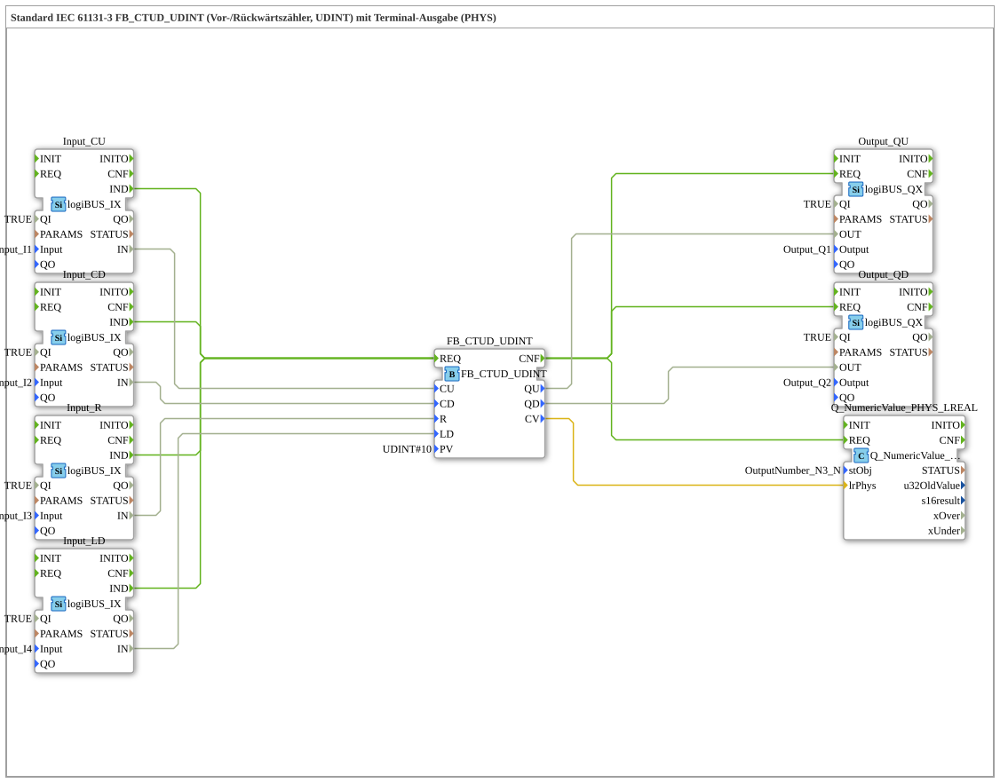

# Exercise_223b: Standard IEC 61131-3 FB_CTUD_UDINT (Forward/Backward Counter, UDINT) with Terminal Output (PHYS)

* * * * * * * * * *
## Introduction
This exercise implements a forward/backward counting function block according to IEC 61131-3 (type `FB_CTUD_UDINT`) with a value range of type `UDINT`. The current counter reading is also output to a terminal (PHYS). The counter functions are controlled via four digital inputs, and two digital outputs signal the counter direction.

## Function Blocks Used (FBs)
- **FB_CTUD_UDINT**
- Type: `iec61131::counters::FB_CTUD_UDINT`
- Parameters: `PV` = `UDINT#10`
- Function: Standard IEC 61131-3 forward/down counter (UDINT). Counts up on each rising edge at `CU` and down at `CD`. The counter is reset to 0 at `R` and loaded from `PV` at `LD`.
- **Input_CU, Input_CD, Input_R, Input_LD**
- Type: `logiBUS::io::DI::logiBUS_IX`
- Parameters:
- `QI` = `TRUE`
- `Input` = `Input_I1` (for CU), `Input_I2` (for CD), `Input_I3` (for R), `Input_I4` (for LD)
- Function: Digital input terminals for acquiring push-button or sensor signals.
- **Output_QU, Output_QD**
- Type: `logiBUS::io::DQ::logiBUS_QX`
- Parameters:
- `QI` = `TRUE`
- `Output` = `Output_Q1` (for QU), `Output_Q2` (for QD)
- Function: Digital output terminals to indicate whether the counter has reached the value `PV` (QU) or whether the value has reached 0 (QD).
- **Q_NumericValue_PHYS_LREAL**
- Type: `isobus::UT::Q::Q_NumericValue_PHYS_LREAL`
- Parameters: `stObj` = `OutputNumber_N3`
- Function: Outputs the current counter value as `LREAL` to the terminal (PHYS). The value is taken directly from `CV` (UDINT) – no type conversion is necessary due to the automatic conversion from UDINT to LREAL.

## Program Flow and Connections

Event control is handled via the `IND` events of the digital inputs. Each key press at an input triggers a `REQ` processing operation of the counter:

1. **Event Connections**

- `Input_CU.IND` → `FB_CTUD_UDINT.REQ`
- `Input_CD.IND` → `FB_CTUD_UDINT.REQ`
- `Input_R.IND` → `FB_CTUD_UDINT.REQ`
- `Input_LD.IND` → `FB_CTUD_UDINT.REQ`
- `FB_CTUD_UDINT.CNF` → `Output_QU.REQ`, `Output_QD.REQ`, `Q_NumericValue_PHYS_LREAL.REQ`

2. **Data Connections**

- `Input_CU.IN` → `FB_CTUD_UDINT.CU`
- `Input_CD.IN` → `FB_CTUD_UDINT.CD`
- `Input_R.IN` → `FB_CTUD_UDINT.R`
- `Input_LD.IN` → `FB_CTUD_UDINT.LD`
- `FB_CTUD_UDINT.QU` → `Output_QU.OUT`
- `FB_CTUD_UDINT.QD` → `Output_QD.OUT`
- `FB_CTUD_UDINT.CV` → `Q_NumericValue_PHYS_LREAL.lrPhys`

Thus, with each change in the state of an input, the counter is recalculated, the outputs are updated, and the current numerical value is displayed on the terminal. The network comment indicates that `UDINT` can be connected to the `LREAL` input without explicit conversion.

## Summary

Exercise 223b demonstrates the use of a standardized IEC 61131-3 forward/down counter (`FB_CTUD_UDINT`) in a control environment. Four digital inputs allow counting up, counting down, resetting, and loading the counter value. Two digital outputs indicate when the limit (`QU`) or zero (`QD`) has been reached. Additionally, the current counter reading is output as a physical value on a terminal (PHYS). The simple wiring and the direct type conversion from `UDINT` to `LREAL` make the circuit particularly easy to understand.
