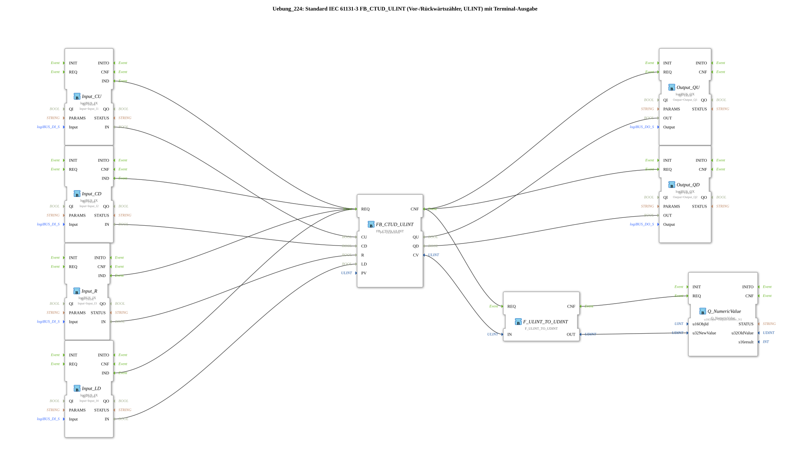

# Exercise_224: Standard IEC 61131-3 FB_CTUD_ULINT (Forward/Down Counter, ULINT) with Terminal Output

* * * * * * * * * *
## Introduction
This exercise implements a combined forward/down counter according to IEC 61131-3 (type `FB_CTUD_ULINT`) with 64-bit preselection (ULINT). The counter value is output to a numeric display via the terminal block `Q_NumericValue`. The inputs are provided via logiBUS digital inputs, and the outputs via logiBUS digital outputs.

## Function Blocks (FBs) Used
- **FB_CTUD_ULINT** – Type: `iec61131::counters::FB_CTUD_ULINT`
- Parameters: `PV` = `ULINT#10` (Preset Value)
- Inputs: `CU` (Count Up), `CD` (Count Down), `R` (Reset), `LD` (Charge PV)
- Outputs: `QU` (Preset Reached, Forward), `QD` (Preset Reached, Backward), `CV` (Current Counter Value)
- Events: `REQ` (call), `CNF` (acknowledgment)
- Functionality: The function block increments on each rising edge at `CU` (forward) or `CD` (backward). At `R=TRUE`, the counter is reset to 0, and at `LD=TRUE`, the value from `PV` is loaded. When the preset value is reached, the outputs `QU`/`QD` are set.

`` - **Input_CU** – Type: `logiBUS::io::DI::logiBUS_IX`

- Parameters: `QI = TRUE`, `Input = Input_I1`
- Inputs: `IND` (event on change), `IN` (data value)
- Function: Digital input that maps the physical input `Input_I1` to the counter input `CU`.
- **Input_CD** – Type: `logiBUS::io::DI::logiBUS_IX`
- Parameters: `QI = TRUE`, `Input = Input_I2`
- Function: Digital input for the down counter input `CD`.
- **Input_R** – Type: `logiBUS::io::DI::logiBUS_IX`
- Parameters: `QI = TRUE`, `Input = Input_I3`
- Function: Digital input for the reset input `R`.
- **Input_LD** – Type: `logiBUS::io::DI::logiBUS_IX`
- Parameters: `QI = TRUE`, `Input = Input_I4`
- Function: Digital input for the charging input `LD`.
- **Output_QU** – Type: `logiBUS::io::DQ::logiBUS_QX`
- Parameters: `QI = TRUE`, `Output = Output_Q1`
- Function: Digital output that passes the state of `QU` to the physical output `Output_Q1`.
- **Output_QD** – Type: `logiBUS::io::DQ::logiBUS_QX`
- Parameters: `QI = TRUE`, `Output = Output_Q2`
- Function: Digital output that transmits the state of `QD` to the physical output `Output_Q2`.
- **F_ULINT_TO_UDINT** – Type: `iec61131::conversion::F_ULINT_TO_UDINT`
- Inputs: `IN` (ULINT), Outputs: `OUT` (UDINT)
- Events: `REQ`, `CNF`
- Function: Converts the 64-bit counter value (`CV`) to a 32-bit value. **Caution:** Values > 2³² may result in an overflow (see comment).

`` - **Q_NumericValue** – Type: `isobus::UT::Q::Q_NumericValue`

- Parameters: `u16ObjId = OutputNumber_N1`
- Inputs: `REQ`, `u32NewValue`
- Function: Outputs the passed numeric value to the terminal (numeric display).

## Program Flow and Connections

1. **Event Control**

Each digital input (Input_CU…Input_LD) generates an event (`IND`) upon a state change. All these events are connected to the `REQ` input of the counter `FB_CTUD_ULINT`. This increments the counter every time a key is pressed at one of the four inputs.

`` *Note:* Since simultaneous events from multiple inputs are (or may not be) combined into a single call, undesirable behavior may occur. The comment therefore recommends including one or two `E_D_FF` (Event DFlipFlops) to reduce the number of events.

2. **Data Connections**

- The digital input values (`IN`) are routed directly to the corresponding counter inputs (`CU`, `CD`, `R`, `LD`).
- The counter's outputs `QU` and `QD` are connected to the digital outputs (`Output_QU`, `Output_QD`).
- The current counter value `CV` is reduced to 32 bits via the conversion block `F_ULINT_TO_UDINT` and passed to the terminal block `Q_NumericValue`.
- The event chain `FB_CTUD_ULINT.CNF` simultaneously triggers the output function blocks and the conversion. After the conversion, `Q_NumericValue` is updated.

`` 3. **Parameters**

The preset value `PV` is set to `ULINT#10` – a comparison with this value sets the outputs `QU`/`QD`.

4. **Learning Objectives**

- Familiarity with the IEC 61131-3 counter `FB_CTUD_ULINT`.
- Handling digital inputs/outputs via logiBUS.
- Use of conversion blocks and terminal output.
- Awareness of event collisions and possible solutions using `E_D_FF`.

5. **Difficulty Level:** Medium

**Prerequisites:** Basic knowledge of the 4diac IDE, experience with logiBUS I/O modules, and event wiring.

## Summary

Exercise 224 implements a complete forward/down counter with 64-bit resolution and a terminal display. Four digital inputs control counting, reset, and loading a preset value. The outputs signal when the preset value is reached. The optional `E_D_FF` modules provide stabilization during multiple simultaneous events. This example demonstrates the practical application of counters, I/O connectivity, and data type conversion in 4diac.

---

### 🌐 Related topic subpages on ms-muc-docs.de
* [🌐 Eclipse 4diac IDE & Color Reference on ms-muc-docs.de](https://www.ms-muc-docs.de/iec-61499/eclipse-4diac/)
