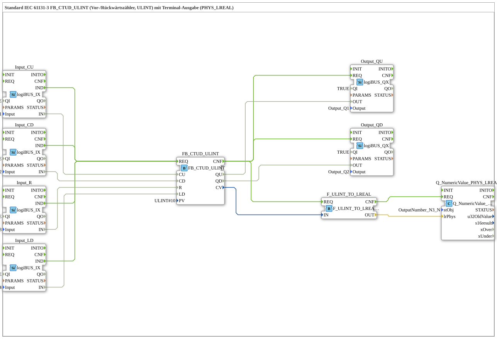

# Exercise_224b: Standard IEC 61131-3 FB_CTUD_ULINT (Up/Down Counter, ULINT) with Terminal Output (PHYS_LREAL)

* * * * * * * * * *
## Introduction

This exercise implements an up/down counter according to IEC 61131-3 (function block `FB_CTUD_ULINT`) with the data type `ULINT`. The current counter value is converted into a physical value (`LREAL`) via a converter and displayed on a terminal output (e.g., a control panel). Control is achieved via four digital inputs (CU, CD, R, LD), and two digital outputs indicate the limit signals (QU, QD).
## Function Blocks (FBs) Used

- **`FB_CTUD_ULINT`** (Type: `iec61131::counters::FB_CTUD_ULINT`)
- Parameters: `PV` = `ULINT#10`
- Event Input: `REQ` (trigger)
- Event Output: `CNF`
- Data Inputs: `CU` (count up), `CD` (count down), `R` (reset), `LD` (load)
- Data Outputs: `QU` (upper limit) `QD` (lower limit), `CV` (current counter reading)
- Functionality: Implements a forward/downward counter. The counter is incremented on each rising event at `CU` and decremented on `CD`. The counter is reset to 0 on `R` and loaded with the value from `PV` on `LD`. Outputs `QU` and `QD` are set when the counter reading reaches the programmed limit.

`` - **`Input_CU`** (Type: `logiBUS::io::DI::logiBUS_IX`)

- Parameters: `QI` = `TRUE`, `Input` = `Input_I1`
- Function: Digital input that reads the physical input `I1` of the logiBUS module.
- **`Input_CD`** (Type: `logiBUS::io::DI::logiBUS_IX`)
- Parameters: `QI` = `TRUE`, `Input` = `Input_I2`
- Function: Digital input for `I2`.
- **`Input_R`** (Type: `logiBUS::io::DI::logiBUS_IX`)
- Parameters: `QI` = `TRUE`, `Input` = `Input_I3`
- Function: Digital input for `I3`.
- **`Input_LD`** (Type: `logiBUS::io::DI::logiBUS_IX`)
- Parameters: `QI` = `TRUE`, `Input` = `Input_I4`
- Function: Digital input for `I4`.
- **`Output_QU`** (Type: `logiBUS::io::DQ::logiBUS_QX`)
- Parameters: `QI` = `TRUE`, `Output` = `Output_Q1`
- Function: Digital output that controls the physical output `Q1`.
- **`Output_QD`** (Type: `logiBUS::io::DQ::logiBUS_QX`)
- Parameters: `QI` = `TRUE`, `Output` = `Output_Q2`
- Function: Digital output for `Q2`.
- **`F_ULINT_TO_LREAL`** (Type: `iec61131::conversion::F_ULINT_TO_LREAL`)
- Function: Converts the `ULINT` counter value to a `LREAL` value for output.
- **`Q_NumericValue_PHYS_LREAL`** (Type: `isobus::UT::Q::Q_NumericValue_PHYS_LREAL`)
- Parameters: `stObj` = `OutputNumber_N3` (Reference to a terminal object)
- Function: Displays a numeric value as a physical quantity (`LREAL`) on the terminal.

## Program Flow and Connections

The flow is event-driven via **event connections**:

- Each digital input (`Input_CU`, `Input_CD`, `Input_R`, `Input_LD`) generates a `IND` event when the input state changes.
- These four events are all routed to the `REQ` event input of the counter `FB_CTUD_ULINT`.
- After processing each event, the counter generates a `CNF` event. This event is passed on to three components in parallel:
- `Output_QU.REQ` – updates the digital output `QU`
- `Output_QD.REQ` – updates the digital output `QD`
- `F_ULINT_TO_LREAL.REQ` – starts the counter reading conversion
- After the conversion is complete, `F_ULINT_TO_LREAL` generates a `CNF` event, which is passed on to `Q_NumericValue_PHYS_LREAL.REQ` to update the display.

`Output_QU.REQ` – updates the digital output `Output_QD.REQ` – updates the digital output `QD`

`Output_QD.REQ` – updates the digital output `QD`

`Output_QD.REQ` – updates The **data connections** transmit the following values:

- The digital input signals (`Input_*.IN`) are routed directly to the corresponding data inputs of the meter: `CU`, `CD`, `R`, `LD`.
- The output signals of the meter (`QU`, `QD`) are connected to the digital outputs `Output_QU.OUT` and `Output_QD.OUT`.
- The current meter reading (`CV`) is fed into the converter `F_ULINT_TO_LREAL.IN`.

... - The converted `LREAL` signal (`OUT`) is sent to the terminal block `Q_NumericValue_PHYS_LREAL.lrPhys` and displayed there.

**Note:** A comment in the network indicates that one or two `E_D_FF` blocks can be added, if needed, to reduce the event frequency. This can be useful when multiple inputs are switching simultaneously.

## Summary

This exercise demonstrates the use of an IEC 61131-3 forward/down counter (`FB_CTUD_ULINT`) in 4diac. The digital hardware (inputs I1–I4, outputs Q1–Q2) is connected via logiBUS blocks. The counter reading is converted into a physical measurement value (`LREAL`) and displayed on a terminal. Learning objectives include working with counter blocks, event chaining, type conversion, and connecting inputs/outputs in an event-driven environment.

---

### 🌐 Related topic subpages on ms-muc-docs.de

* [🌐 Eclipse 4diac IDE & color reference on ms-muc-docs.de ](https://www.ms-muc-docs.de/iec-61499/eclipse-4diac/)
