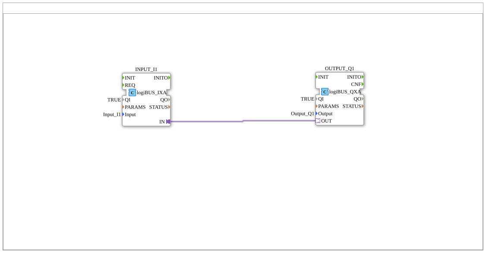

# Training_02_OPC_UA_RES: Distributed I1→Q1 over OPC-UA ("RES style")

* * * * * * * * * *
## Introduction

`Training_02_OPC_UA_RES` shows the basic `Input_I1` → `Output_Q1` pattern
from `test_B/Uebungen/Uebung_001.SUB` — now genuinely **distributed** across
two FORTE devices: `FORTE_PC_A` (192.168.1.11) reads `Input_I1`,
`FORTE_PC_B` (192.168.1.12) drives `Output_Q1`. The link between them runs
over OPC-UA rather than FORTE's own multicast (already shown by
`Training_01_PUBLISH_SUBSCRIBE`).

The name comes from the **"RES style"**: the actual communication blocks
(`AX_CLIENT_1_0`, `AX_SUBSCRIBE_1`) live in each device's `<Resource>`, not
in the Application composite itself. This matches the canonical IEC 61499
distribution pattern from `distribute4diac.adoc` and the existing
`Training_01_PUBLISH_SUBSCRIBE` precedent. The sibling exercise
`Training_01_OPC_UA_SUB` shows the counterpart design for the same use case
("SUB style", the Krauternter production pattern): there the protocol lives
directly inside the reusable `MyLib::sys` composite instead of the
resource.

## Function Blocks Used

| Instance | Location | Type | Purpose |
|---|---|---|---|
| `INPUT_I1` | Application (`App_OPC_UA_RES`) | `logiBUS::io::DI::logiBUS_IXA` | Reads `Input_I1`, exposes the state as an AX adapter Plug |
| `OUTPUT_Q1` | Application (`App_OPC_UA_RES`) | `logiBUS::io::DQ::logiBUS_QXA` | Drives `Output_Q1`, accepts the state via an AX adapter Socket |
| `CLIENT_Q1` | Resource `EMB_RES_A` (Device A) | `adapter::net::AX_CLIENT_1_0` | Active remote write to the OPC-UA node monitored by Device B |
| `SUBSCRIBE_Q1` | Resource `EMB_RES_B` (Device B) | `adapter::net::AX_SUBSCRIBE_1` | Locally monitored OPC-UA node, remotely written by Device A |

The Application itself contains **no** OPC-UA blocks — it is deliberately
kept exactly as it would look in a non-distributed exercise
(`INPUT_I1.IN` → `OUTPUT_Q1.OUT`, a direct Plug→Socket adapter connection,
identical to the pattern in `Uebung_001.SUB`). Only the `Mapping` splits the
two FBs onto different devices; the actual network transfer is handled by
`CLIENT_Q1`/`SUBSCRIBE_Q1` below, in each device's own Resource FBNetwork.

## OPC-UA Address Space

Both constants live in `VV::const::OPC_UA::myOpcUaAddresses` and share the
same node path/name — only the ACTION and (for `CLIENT`) the target
endpoint differ:

| Constant | Value | Used by |
|---|---|---|
| `Q1_LOCAL_READ` | `opc_ua[READ;/Objects/DigitalOutput/Q1,1:s=Output_Q1]` | `SUBSCRIBE_Q1` on Device B (locally monitored node, `Local\|READ\|SUBSCRIBE`) |
| `Q1_REMOTE_WRITE` | `opc_ua[WRITE;opc.tcp://192.168.1.12:4840#;/Objects/DigitalOutput/Q1,1:s=Output_Q1]` | `CLIENT_Q1` on Device A (active remote write, `Remote\|WRITE\|CLIENT`) |

## Program Flow and Connections

1. **Application** (`App_OPC_UA_RES`): `INPUT_I1` (`logiBUS_IXA`,
   `Input_I1`) is directly connected to `OUTPUT_Q1` (`logiBUS_QXA`,
   `Output_Q1`) via an adapter connection (`INPUT_I1.IN` →
   `OUTPUT_Q1.OUT`) — the purely logical model, independent of the later
   device distribution.
2. **Mapping**: `INPUT_I1` → `FORTE_PC_A.EMB_RES_A`, `OUTPUT_Q1` →
   `FORTE_PC_B.EMB_RES_B`.
3. **Resource `EMB_RES_A`** (Device A): `START.COLD` first initializes
   `App_OPC_UA_RES.INPUT_I1` itself (dotted-path reference to its
   `.INIT`); only its `.INITO` confirmation triggers `CLIENT_Q1.INIT`.
   The actual adapter connection `App_OPC_UA_RES.INPUT_I1.IN` →
   `CLIENT_Q1.IN` bridges the mapping boundary via dotted-path reference —
   Application Plug and Resource Socket wired directly, with no
   intermediate block.
4. **Resource `EMB_RES_B`** (Device B): mirrored — `START.COLD` →
   `SUBSCRIBE_Q1.INIT`, its `.INITO` → `App_OPC_UA_RES.OUTPUT_Q1.INIT`,
   and `SUBSCRIBE_Q1.OUT` → `App_OPC_UA_RES.OUTPUT_Q1.OUT` (again a direct
   Plug→Socket adapter connection across the mapping boundary).
5. **Runtime**: When `Input_I1` changes on Device A, `CLIENT_Q1` writes the
   new value via OPC-UA to `opc.tcp://192.168.1.12:4840`, into the node
   monitored by `SUBSCRIBE_Q1` — Device B picks up the value and drives
   `Output_Q1`. This link does **not** exist as a model connection in the
   `.sys` file at all — it happens purely as OPC-UA network communication
   at runtime.

## Technical Notes

- **Adapter connections can cross the mapping boundary**: contrary to the
  original assumption, 4diac accepts an `AdapterConnections` entry between
  an Application FB pin and a Resource FB pin via a dotted-path reference —
  exactly like a plain event/data connection (see
  `Training_01_PUBLISH_SUBSCRIBE`). A separate conversion block
  (`AX_BOOL_TO_X`/`AX_X_TO_BOOL`) is therefore not needed here, because
  `INPUT_I1`/`OUTPUT_Q1` are themselves already adapter-based
  (`logiBUS_IXA`/`logiBUS_QXA`).
- **Two-stage initialization**: `START.COLD` first initializes the physical
  I/O block (`INPUT_I1`/`OUTPUT_Q1`); only its `INITO` triggers the
  communication block (`CLIENT_Q1`/`SUBSCRIBE_Q1`) — ensuring the I/O
  binding is up before the OPC-UA channel goes active.

## Learning Objectives

- Canonical IEC 61499 distribution pattern: the Application stays
  device-neutral, portable logic; each device's Resource carries the
  protocol-specific communication.
- Correct ACTION pairing for locally monitored (`READ`/`SUBSCRIBE`) versus
  remotely written (`WRITE`/`CLIENT`) OPC-UA nodes.
- Explicit initialization ordering (`START.COLD` → I/O block →
  communication block) instead of blindly relying on automatic EInit
  firing.

**Difficulty**: Intermediate
**Prerequisites**: `Uebung_001.SUB` (the basic I1→Q1 pattern), basics of the
OPC-UA adapter blocks (`AX_CLIENT_1_0`/`AX_SUBSCRIBE_1`), IEC 61499
mapping/distribution concepts.

## Summary

`Training_02_OPC_UA_RES` carries the trivial `Uebung_001.SUB` pattern
(`Input_I1` → `Output_Q1`) over to two physically separate FORTE devices,
demonstrating the canonical IEC 61499 "RES style" distribution pattern:
portable logic at the Application level, communication at the Resource
level, linked across the mapping boundary via a dotted-path adapter
connection.

---

### 🌐 Related Topic Subpages on ms-muc-docs.de

* [🌐 Eclipse 4diac IDE & Color Reference on ms-muc-docs.de](https://www.ms-muc-docs.de/iec-61499/eclipse-4diac/)
