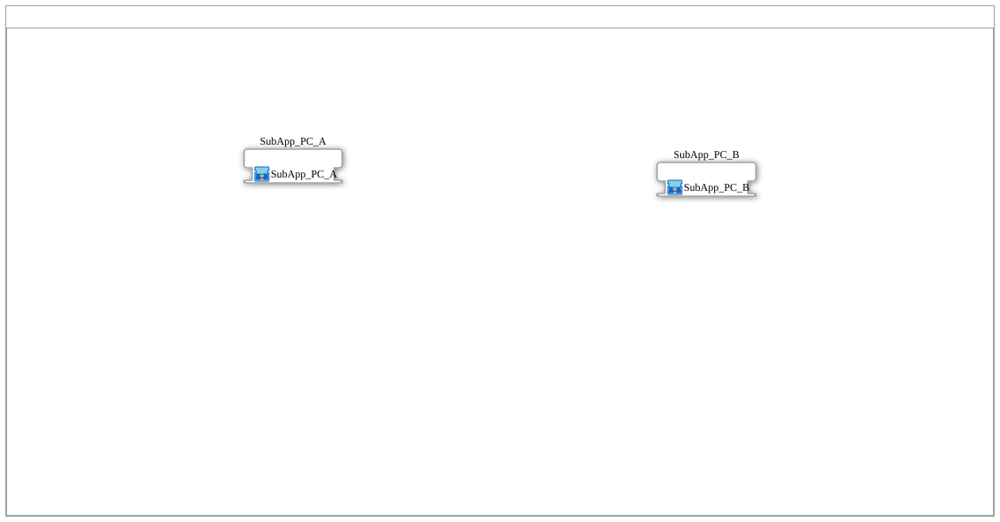

# Training_09_OPC_UA_RES: Toggle Flip-Flop over OPC-UA — Adapter Variant of Training_08

* * * * * * * * * *

## Introduction

`Training_09_OPC_UA_RES` is the adapter variant of `Training_08_OPC_UA_RES`
(and thus also of `Training_03_OPC_UA_RES`) — it completes the series of
three before/after adapter pairs:

| Action set | Manual | Adapter |
|---|---|---|
| Toggle-only | Training_03 / **Training_08** | **Training_09** |
| Set/Reset | Training_05 | Training_07 |
| Set/Reset/Toggle | Training_04 | Training_06 |

Instead of the `ASRT_AX_*`/`ASR_AX_*` combos from Training_06/07, this one
uses the **single-valued** `AE_AX_*` adapter blocks (`AE` = Adapter Event, a
single trigger with no Set/Reset distinction). Same OPC-UA addresses as
Training_03/08 (`FF1_*`).

## Composites Used

| Composite | Device | Purpose |
|---|---|---|
| [`SoftKeyT_PC_A_OPC_Adapter`](./SoftKeyT_PC_A_OPC_Adapter_network.svg) | A (`192.168.1.11`) | HMI (SoftKey + `GreenWhiteBackground`) behind `SoftKeyT_AE_AX`, OPC-UA trigger behind `AE_AX_CLIENT_0_SUBSCRIBE_1` |
| [`SoftKeyT_PC_B_OPC_Adapter`](./SoftKeyT_PC_B_OPC_Adapter_network.svg) | B (`192.168.1.12`) | `AE_AX_SERVER_0_CLIENT_1_0` bundles `SERVER_0` + `AX_CLIENT_1_0`; `AE_AX_AX_SPLIT` fans out to `DigitalOutput_Q1` and `AE_AX_T_FF` |

## OPC-UA Address Space

Identical to Training_03/08 (`FF1_TRIGGER_*`, `FF1_STATE_*`) — see
[Training_03_OPC_UA_RES](../Training_03_OPC_UA_RES/Training_03_OPC_UA_RES.md#opc-ua-address-space).

## Program Flow and Connections

1. **`SoftKeyT_PC_A_OPC_Adapter`** (Device A): `SoftKeyT_AE_AX` bundles
   the SoftKey + `GreenWhiteBackground` behind an `AE_AX` Plug; an adapter
   connection (`SoftKeyT_AE_AX.OUT` → `TRIGGER.TRIGGER`) hands the
   trigger/state off to `AE_AX_CLIENT_0_SUBSCRIBE_1` (`TRIGGER`).
2. **`SoftKeyT_PC_B_OPC_Adapter`** (Device B): `TRIGGER`
   (`AE_AX_SERVER_0_CLIENT_1_0`) delivers the trigger/state bundle via
   `TRIGGER.TRIGGER` to `SPLIT` (`AE_AX_AX_SPLIT`), which passes it on to
   `FLIPFLOP.CLK` (`AE_AX_T_FF`); `SPLIT.AX_OUT` drives `DigitalOutput_Q1`
   in parallel.

## Technical Notes

- **`AE_AX_*` as the simplest base combo**: the simplest of the three combo
  families in this series — a single `TRIGGER` pin rather than `S_R`
  (Training_07) or `S_R_T` (Training_06), since a pure toggle trigger
  needs no action distinction.
- **The full adapter toolbox visible**: together with Training_06/07,
  Training_09 shows all three tiers of the adapter-3.0.0 combo family
  (`AE_AX_*`/`ASR_AX_*`/`ASRT_AX_*`) in direct functional comparison to
  their manually wired counterparts.

## Learning Objectives

- Single-valued adapter combo blocks (`AE_AX_CLIENT_0_SUBSCRIBE_1`,
  `AE_AX_SERVER_0_CLIENT_1_0`) as the simplest tier of the series.
- A complete overview: all three adapter combo tiers (`AE`/`ASR`/`ASRT`)
  compared to their manual counterparts.

**Difficulty**: Advanced
**Prerequisites**: `Training_08_OPC_UA_RES`, `Training_06_OPC_UA_RES`/
`Training_07_OPC_UA_RES` (same adapter pattern, different action sets).

## Summary

`Training_09_OPC_UA_RES` closes out the series: the single-valued `AE_AX_*`
adapter variant of the toggle-only pattern, functionally identical to
Training_03/08, using the same bundling logic as Training_06/07.

---

### 🌐 Related Topic Subpages on ms-muc-docs.de

- [🌐 Eclipse 4diac IDE & Color Reference on ms-muc-docs.de](https://www.ms-muc-docs.de/iec-61499/eclipse-4diac/)
