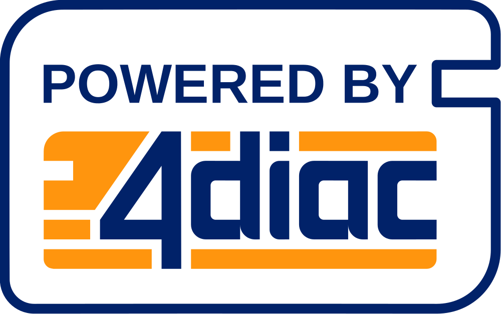

---
myst:
  enable_extensions: ["colon_fence", "admonition"]
  html_meta:
    "description lang=de": "Dokumentation für visuelle Programmiersprachen und IEC 61499"
    "keywords": "IEC 61499, 4diac, SPS, Automatisierung, Visuelle Programmierung"
    "property=og:locale": "de"
---

# Wiki 4: Visuelle Programmiersprachen

## Meisterschulen am Ostbahnhof, München

---

**Willkommen bei der Dokumentation zu visuellen Programmiersprachen.**

Diese Dokumentation ist Teil der Wissensdatenbank der Meisterschulen am Ostbahnhof München.

**Nützliche Links:**
* [🏠 Hauptmenü](https://www.ms-muc-docs.de/)
* [🔍 Super-Suche (alle Wikis)](https://meisterschulen-am-ostbahnhof-munchen-docs.readthedocs.io/de/latest/)
* [📄 PDF-Handbuch herunterladen](https://meisterschulen-am-ostbahnhof-munchen.github.io/visual-programming-languages-docs/de/pdf/document.pdf)

---

Willkommen in der Welt der grafischen Programmierung! Diese Dokumentation bietet Ihnen einen umfassenden Einstieg in die Konzepte der visuellen Programmierung, mit einem besonderen Fokus auf die industrielle Automatisierung nach **IEC 61499**.

---

## 🚀 Einstieg

Haben Sie sich jemals gefragt, wie man Programme visuell erstellt? Hier finden Sie Ressourcen für Anfänger und Fortgeschrittene – von den Grundlagen in **Blockly** oder **Scratch** bis hin zur professionellen Anwendung in der Industrie.

:::{grid} 2
:gutter: 3

**Warum visuelle Programmierung?**
Abstraktion komplexer Logik in intuitive grafische Bausteine.

**Fokus IEC 61499**
Der Standard für verteilte, ereignisorientierte Steuerungssysteme.
:::

---

## 📖 Kernkonzepte

### IEC 61499 & 4diac
Die **IEC 61499** ist eine internationale Norm für die Echtzeit-Verarbeitung in verteilten Steuerungssystemen. Sie bietet eine flexible Plattform und eine gemeinsame Sprache für die Kommunikation zwischen Systemen. 

**Eclipse 4diac** ist die führende Open-Source-Entwicklungsumgebung für diesen Standard. Sie ermöglicht es, komplexe industrielle Anwendungen effizient zu modellieren und zu verteilen.

---

## 🎭 Ein wenig Inspiration

:::{admonition} Die IEC 61499 – Ein Gedicht im Stile Goethes
:class: note, dropdown

Die IEC 61499,  
ein System moderner Prägung.  
Wie ein Uhrwerk, stets in Line,  
gestaltet es die Automatisierung.  

In Schichten aufgebaut,  
wie ein Turm aus Bauklotzsteinen.  
Jeder Baustein gut durchdacht,  
um Funktionen zu vereinen.  

Wie ein Gedanke, der durch den Kopf geht,  
so fließt das Programm durch die Schichten.  
Dynamisch, flexibel, stets bereit,  
die Systeme zu steuern und zu richten.
:::

---

## 🛠 Navigation

!!! note
    Dieses Projekt befindet sich in aktiver Entwicklung. Fragen oder Anregungen? 
    Besuchen Sie unser [Discussion Forum](https://github.com/Meisterschulen-am-Ostbahnhof-Munchen/visual-programming-languages-docs/discussions).

---

[🏠 Hauptmenü](https://www.ms-muc-docs.de/) | [🔍 Super-Suche (alle Wikis)](https://meisterschulen-am-ostbahnhof-munchen-docs.readthedocs.io/de/latest/) | [Schnelle Suche (IEC 61499)](https://www.ms-muc-docs.de/iec-61499/abk%C3%BCrzungen-und-bedeutungen/abk%C3%BCrzungen-und-bedeutungen)
