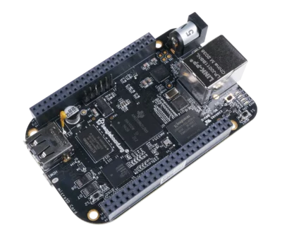

# BeagleBoneBlack
https://docs.beagle.cc/boards/beaglebone/black/index.html

## Übersicht
Der BeagleBone Black ist eine kostengünstige, community-unterstützte Entwicklungsplattform für Embedded Systems, die als Target-Device für 4diac IDE Anwendungen genutzt werden kann.

## Technische Spezifikationen
- **Prozessor**: AM335x 1GHz ARM® Cortex-A8
- **Memory**: 512MB DDR3 RAM
- **Storage**: 4GB 8-bit eMMC on-board flash storage
- **Connectivity**:
  - USB client für Power und Kommunikation
  - USB host
  - Ethernet (10/100)
- **Expansion**:
  - 2x 46-pin Header mit GPIO, Analog Inputs, PWM, I2C, SPI und Serial Interfaces
- **Power**: 5V DC via USB oder Barrel Jack

### Voraussetzungen
- Linux Image auf dem BeagleBone Black installiert
- Netzwerkverbindung zum Entwicklungssystem

### I/O Mapping
Die GPIO Pins des BeagleBone Black können auf 4diac Function Block I/Os gemappt werden:

| 4diac Interface | BeagleBone Black Pin |
|-----------------|----------------------|
| %IX0.0          | P8_7 (GPIO66)        |
| %QX0.0          | P8_8 (GPIO67)        |
| %IX0.1          | P8_9 (GPIO69)        |
| %QX0.1          | P8_10 (GPIO68)       |
