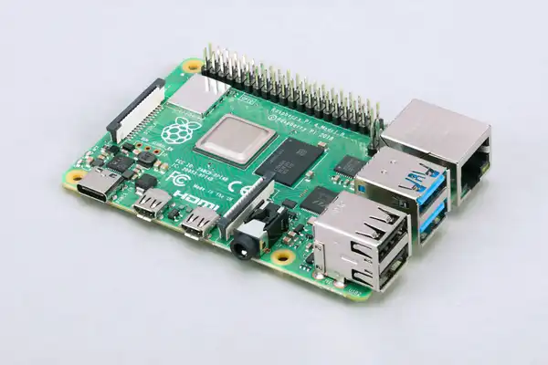

### RaspberryPI
# Raspberry Pi - 4diac IDE Device Dokumentation  

## Übersicht  
Der **Raspberry Pi** ist ein preiswerter Einplatinencomputer, der als **Target-Device** für **4diac IDE** eingesetzt werden kann. Dank seiner **GPIO-Schnittstelle** eignet er sich besonders für **Steuerungs- und Automatisierungsaufgaben**.  

 

## Technische Spezifikationen (example Raspberry Pi 4 Model B)  
- **Prozessor**: Broadcom BCM2711, Quad-Core Cortex-A72 (1,5 GHz)  
- **Memory**: 2GB / 4GB / 8GB LPDDR4 RAM  
- **Storage**: microSD-Karte (ab 8GB empfohlen)  
- **Connectivity**:  
  - 2x USB 3.0, 2x USB 2.0  
  - 2x **Micro-HDMI** (bis 4K @ 60Hz)  
  - **Gigabit Ethernet** (mit PoE-Unterstützung via HAT)  
  - **Wi-Fi 5 (802.11ac)** & **Bluetooth 5.0**  
- **GPIO**:  
  - **40-Pin-Header** mit **digitalen I/Os**, **PWM**, **I²C**, **SPI**, **UART**  
  - 3,3V Logikpegel (keine 5V-Toleranz!)  
- **Power**: 5V/3A via USB-C  

## 4diac IDE Unterstützung  
Der Raspberry Pi läuft unter **Linux** und kann mit **4diac FORTE** als **IEC 61499 Runtime** betrieben werden.  

### Voraussetzungen  
- **Betriebssystem**: Raspberry Pi OS (32/64-Bit)  
- **Java Runtime Environment (JRE)** für 4diac FORTE  
- **Netzwerkverbindung** (SSH für Remote-Entwicklung)  

### I/O-Mapping (GPIO-Beispiel)  
| 4diac Interface | Raspberry Pi Pin | Funktion |  
|----------------|------------------|----------|  
| `%IX0.0`       | GPIO17 (Pin 11)  | Digital Input |  
| `%QX0.0`       | GPIO18 (Pin 12)  | Digital Output |  
| `%IW0`         | SPI0 (MISO/MOSI) | Analog Input (via ADC) |  
| `%QW0`         | PWM0 (GPIO12)    | PWM Output |  
