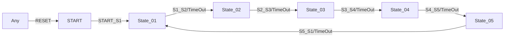

# sequence_ET_05_loop


* * * * * * * * * *

## Einleitung
Der **sequence_ET_05_loop** ist ein zyklischer 5-Zustands-Automat nach IEC 61499 mit kombinierter Ereignis- und Zeitsteuerung.
Entwickelt unter EPL-2.0 Lizenz, realisiert er endlose Arbeitszyklen mit automatischem Rücklauf von State_05 zu State_01.

## Schnittstellenstruktur

### **Ereignis-Eingänge**
| Event | Trigger | Besonderheit |
|-------|---------|--------------|
| `START_S1` | START → State_01 | Initialisiert alle Zeitparameter |
| `S1_S2`-`S4_S5` | Manuelle Zustandsübergänge | Direkter Trigger |
| `S5_S1` | Manueller Zyklusneustart | State_05 → State_01 |
| `RESET` | Globaler Reset | Jeder Zustand → START |

### **Ereignis-Ausgänge**
| Event | Auslöser | Daten |
|-------|----------|-------|
| `CNF` | Jeder Zustandswechsel | STATE_NR (SINT) |
| `EO_S1`-`EO_S5` | Zustandseintritt | DO_Sx (BOOL) |

### **Daten-Eingänge**
- `DT_S1_S2`-`DT_S5_S1` (TIME):
  - Zeitintervalle für automatische Übergänge
  - Bereich: T#1ms bis T#49d
  - `NO_TIME` deaktiviert Zeitsteuerung

### **Daten-Ausgänge**
| Variable | Typ | Wertebereich |
|----------|-----|-------------|
| `STATE_NR` | SINT | 0=START, 1-5=State_01-05 |
| `DO_S1`-`DO_S5` | BOOL | 0/1 |

### **Adapter**
- `timeOut` (ATimeOut): Steuert zeitgesteuerte Übergänge

## Funktionsweise

### **Zustandsautomat**


### **Zustandslogik**
1. **Eintrittsaktion**:
   - Setzt entsprechendes DO_Sx = TRUE
   - Startet Timer mit konfiguriertem DT_Sx_Sy

2. **Austrittsaktion**:
   - Setzt aktuelles DO_Sx = FALSE
   - Stoppt Timer

3. **Übergangsbedingungen**:
   - Zeitsteuerung (wenn DT ≠ NO_TIME) **oder**
   - Manuelles Event (Sx_Sy)

## Technische Besonderheiten

✔ **Vollständiger Zyklus**: 5 Arbeitszustände + automatischer Rücklauf  
✔ **Parallele Triggerung**: Zeit- UND Ereignissteuerung pro Schritt  
✔ **Echtzeitfähig**: Präzise Zeitsteuerung bis 1ms  
✔ **Robuste Initialisierung**: Expliziter START-Zustand  

## Zustandsübersicht

| Zustand | STATE_NR | Aktiver Ausgang | Timer-Parameter |
|---------|----------|-----------------|-----------------|
| START   | 0        | -               | -               |
| State_01| 1        | DO_S1           | DT_S1_S2        |
| State_02| 2        | DO_S2           | DT_S2_S3        |
| State_03| 3        | DO_S3           | DT_S3_S4        |
| State_04| 4        | DO_S4           | DT_S4_S5        |
| State_05| 5        | DO_S5           | DT_S5_S1        |

## Anwendungsszenarien

- **Kontinuierliche Fertigung**:
  ```
  Materialzufuhr → Bearbeitung → Qualitätskontrolle → Verpackung → Logistik → (Neustart)
  ```
- **Zyklische Wartung**:
  ```
  Diagnose → Reinigung → Schmierung → Kalibrierung → Protokollierung → (Wiederholung)
  ```
- **Batch-Prozesse**:
  ```
  Chargenvorbereitung → Reaktionsphase → Kühlung → Abfüllung → Reinigung → (Neue Charge)
  ```

## Vergleich mit ähnlichen Bausteinen

| Feature          | sequence_ET_05_loop | sequence_ET_05 | SFC-Cycle |
|------------------|---------------------|----------------|-----------|
| Zyklusende      | State_01 (Loop)     | START          | Beliebig  |
| Zustandsanzahl  | 5 + START           | 5 + START      | Unbegrenzt|
| Reset-Tiefe     | Vollständig         | Vollständig    | Teilweise |

## Fazit

Der sequence_ET_05_loop ist ideal für:

1. **Endlose Prozessketten**: Automatischer Neustart ohne externe Steuerung  
2. **Komplexe Zyklen**: 5 klar getrennte Arbeitsphasen  
3. **Industrielle Automatisierung**: Robuste Zeit- und Eventsteuerung  

*Optimale Einsatzgebiete*:  
- Kontinuierliche Produktionslinien  
- Zyklische Prüfstände  
- Automatisierte Logistiksysteme  

*Hinweis*: Für einmalige Abläufe sequence_ET_05 verwenden.
